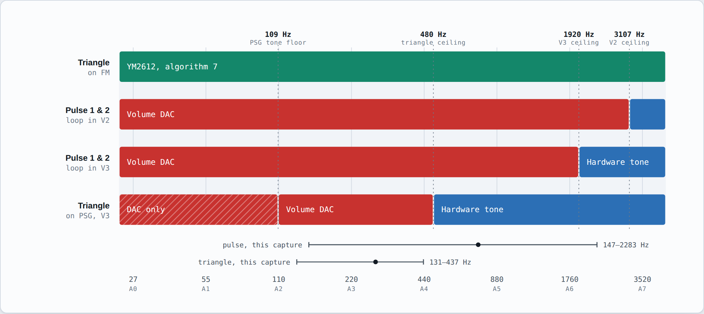
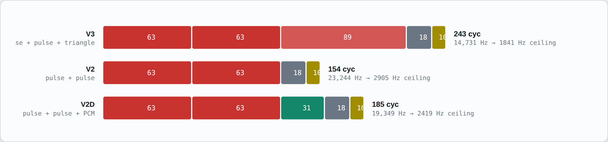
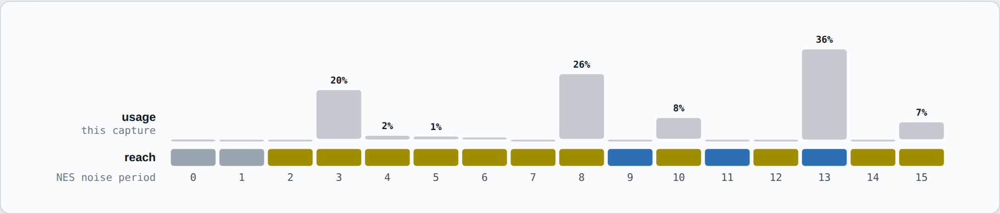

# GeNESis-APU2PSG: Playback NES audio data on Genesis/Mega Drive

This project is devoted to Krikkz, the inventor of EverDrive.  

I used it to play a MegaDrive port of Super Mario Bros. 1, and it mapped some of the soundtrack to the FM synth. I think it was just the bass, but still very cool to hear it playback with that Sega character. Then I learned, that the Everdrive PRO, actually included a NES core on the FPGA. I was then struck by the idea to do this project--after all it should be possible. 

I chose to start with the PSG only because even without layering FM color, the difference in soundchip and circuitry on the two different hardware platforms, should still produce some distinctly-Sega timbre, in theory. I thought about how to use the PSG to emulate the Triangle channel, and pulse waves with Duty other than 50%. Ultimately, to avoid the FM synth to the utmost, probably requires Z80 assembly.

Currently, frequency-accurate playback of each channel is working. Volume modulation per NES envelopes is working on all channels. <s> except Square 3, which is Triangle on NES.</s>  This is enough to get a song to playback very recognizably.   

**It requires Z80 assembly, and now it has some.** The PSG's attenuator is a 4-bit logarithmic DAC; park a tone channel's period at 0 so its output is DC and rewrite that attenuator fast enough, and the channel stops being a square wave and becomes a waveform generator. That gives real 12.5% / 25% / 75% pulses and a real triangle staircase, on the PSG, with no FM. It also has hard limits, and those limits are why this is now a *combination* of techniques rather than one.

<picture>
  <source media="(prefers-color-scheme: dark)" srcset="docs/crossover-dark.png">
  
</picture>

*Which technique covers which pitch, per voice. Red is the volume DAC, blue is the PSG's own tone generator; the hatched zone is where the DAC is not an upgrade but the only option. Full interactive version: **[the crossover map](https://claude.ai/code/artifact/09fba06d-d92a-44e6-b7d8-c447f013e359)**. Details below.*


Requirements:
- SGDK
- FCEUX NES Emulator
- Gens r57Shell Genesis/MegaDrive Emulator
- Python 3, only if you want to rebuild the Z80 driver (the assembled blob is checked in)

You must use SGDK to build the ROM.

# To record NES audio:
Open up FCEUX, load GeNESis-APU2PSG-Recorder lua script. It should run without error. 
Load a NES Rom file and the script will imediately start logging the audio data

# To playback NES audio on Genesis/MegaDrive:
Both the Sega ROM and the lua script GeNESis-APU2PSG-Player must be loaded. 
As long as the NES data file exists, in same directory as gens executable, it should playback the song using the PSG chip.

# To use the live synced version:
Have to have both scripts running at the same time, in the same directory. Turn down the NES emulator audio in OS settings.


# The technique map

Four techniques, none of which covers the whole job. What follows is which one wins where, and why.

The figures here and in **[the crossover map](https://claude.ai/code/artifact/09fba06d-d92a-44e6-b7d8-c447f013e359)** are generated, not drawn. Rebuild them from the repo root with `python3 tools/build_map.py technique-map.html`; every coordinate and percentage comes from the assembler's cycle counts and `nes_apu_data.txt`, so the pictures cannot drift from the code.

### 1. Hardware tone generator
The PSG's own square wave. Pitch-exact, costs nothing, works at any pitch the chip can reach. Two limits: it is 50% duty and only 50% duty, and its period register is 10 bits, so it bottoms out at **109 Hz**. The NES triangle goes down to 27 Hz. Below 109 Hz the hardware generator does not go flat, it simply cannot go there at all.

### 2. Volume DAC  *(the main solution)*
Park the tone period at 0 and rewrite the channel's attenuation register from a free-running Z80 loop.

The Sega PSG takes a period of 0 literally, where a discrete SN76489 would substitute 0x400 — so the channel toggles every internal clock, giving a 112 kHz square that the output filter averages to *half* the attenuator's level. That halved level is what the volume DAC modulates, which makes the trick Sega-specific and makes a DAC voice exactly 6 dB quieter than the same channel making a tone: its fundamental is (2/π)(V/2) against a hardware square's (2/π)V. Hardware-path voices therefore carry +3 attenuation steps, or a pulse would jump 6 dB louder the moment it crossed the pitch ceiling. The attenuator is logarithmic, which turns out to be a gift: scaling a waveform by a volume is *addition* in the log domain, so a whole pulse voice is eight instructions with no wavetable at all —

```
        ld de,DELTA         ; phase += delta
        add hl,de
        ld a,h
        cp  DUTY            ; carry <=> inside the high part of the pulse
        sbc a,a             ; -> 0xFF or 0x00
        and SPAN            ; = (attenuation - 15) & 0xFF
        add a,MUTE          ; log-domain volume scaling is just an add
        ld (7F11h),a
```

63 Z80 cycles a voice. The triangle needs a real 32-step table, so it costs 89.

**Sample rate is loop length.** That is the whole cost model, and it is why this "struggles with more pitch or channels" — they are the same problem seen from two sides. Each voice you add lengthens the loop, which lowers the sample rate, which lowers the pitch ceiling for *every* voice. So the driver ships three loop variants and the ROM picks one per frame:

| variant | voices | cycles | sample rate | 12.5% duty ceiling |
|---|---|---|---|---|
| **V3**  | pulse + pulse + triangle | 243 | 14731 Hz | 1841 Hz |
| **V2**  | pulse + pulse            | 154 | 23244 Hz | 2905 Hz |
| **V2D** | pulse + pulse + PCM      | 185 | 19349 Hz | 2419 Hz |

Ten of those cycles in every variant are the service slot — one jump, and the reason the Z80 owns every sound chip on the machine. See below.

<picture>
  <source media="(prefers-color-scheme: dark)" srcset="docs/loop-budget-dark.png">
  
</picture>

A 12.5% pulse needs eight slots per period to exist at all, so the ceiling is the sample rate over eight. Above it the voice is handed back to the hardware tone generator: the pitch stays exact and the duty degrades to 50%, which is a far better trade than an aliased 12.5% pulse.

Measured against the capture checked into this repo (8697 frames):
- **85% of pulse-1 frames use a duty the PSG hardware cannot make** (61.5% at 12.5%, 23.4% at 75%). This is the technique earning its keep.
- **97% of pulse frames sit at or below V3's ceiling**, 100% below V2's. So the crossover fires on about 3% of frames — audible on the high lead runs, which is exactly where it was reported to struggle.

### 3. Tone-clocked noise ("special" noise mode)
The PSG's noise generator has three fixed rates. The NES has sixteen periods in two modes, so 32 sounds. Setting the PSG's noise rate selector to 3 clocks the shift register from **tone channel 2** instead, and channel 2's period is 10 bits — so most of the NES's rate table becomes reachable:

| NES period index | 0 | 1 | 2 | 3 | 4 | 5 | 6 | 7 | 8 | 9 | 10 | 11 | 12 | 13 | 14 | 15 |
|---|---|---|---|---|---|---|---|---|---|---|---|---|---|---|---|---|
| ch2 period (white) | – | – | 1 | 2 | 4 | 6 | 8 | 10 | 13 | 16 | 24 | 32 | 48 | 63 | 127 | 254 |
| period error | – | – | 0% | 0% | 0% | 0% | 0% | 0% | +3.0% | +0.8% | +1.1% | +0.8% | +0.8% | −0.8% | −0.1% | −0.1% |

Fourteen of sixteen. Indices 0 and 1 want a shift-register period below 1 and are out of the chip's reach in white mode — though short mode's ×6.2 pitch factor lifts them back into range.

**The divisor matters more than anything else here.** The shift register advances once per tone-3 *output cycle*, so its rate is clock/(32·P) — the same as the tone frequency, not twice it. Read it the other way and every drum lands an octave out, which is exactly what happened here on the first pass: reasoning from the documented figures alone produced clock/(16·P). Checking a reference implementation settles it in a minute — the noise counter reloads with tone 3's period *doubled*, at the internal clock/16, one shift per expiry, which is also how the three fixed settings come out as clock/512, /1024 and /2048.

That reading places the fixed rates on NES indices **9, 11 and 13**, each to within 0.8% — presumably why the chip has exactly those three.

Two more things worth knowing, both of which this code leans on:

- **Writing tone 2's period updates the noise rate immediately** while mode 3 is selected, with no write to the noise control register. So drum pitch can be swept without retriggering the sequence.
- **The noise control register reseeds the shift register on every write**, not only when the mode bit changes — the Sega part is not the NCR variant. That is what makes the change-guard below a correctness requirement rather than an optimisation.

<picture>
  <source media="(prefers-color-scheme: dark)" srcset="docs/noise-coverage-dark.png">
  
</picture>

*All 16 NES noise periods. Blue is reachable with one of the PSG's three fixed rates, gold needs channel 2 as the shift clock, grey is out of range. Bars are each period's share of noise-active frames in the checked-in capture.*

Short (periodic) mode needs a different mapping. The NES's short sequence is 93 steps; the PSG's periodic mode is a pure rotate of its shift register, so it pulses once per register width. Matching the shift *rate* would put the pitch octaves out, so the table matches perceived pitch instead.

That register is **16 bits wide on the Sega PSG**, not the discrete SN76489's 15 — Sega widened it (feedback mask 0x8000 against 0x4000, taps 0x01/0x08 against 0x01/0x02). Using 15 puts every periodic drum about a semitone flat. Indices 0 and 15 are out of reach and pin at the ends; 15 lands at 6.8 Hz against a target of 4.7, which is below hearing either way.

**The price used to be channel 2, which is where the triangle lives** — that was the trade the old TODO asked about. In the checked-in capture, **64.3% of noise-active frames use a period the three fixed rates cannot reach**; index 13 is the one heavily-used period they do cover. With the triangle moved to FM there is nothing left to pay, so this mode is simply on.

Three further nuances, all of which will bite:

- **Channel 2 keeps making sound while it clocks the noise.** Its own square is still routed to the mixer, and at the slow end of the table it is squarely audible — period 254 sits at 440 Hz. It has to be attenuated to 15 explicitly.
- **Writing the noise control register resets the shift register.** Rewriting the same value every frame restarts the noise pattern 60 times a second, which is a 60 Hz buzz rather than a drum. The register is only written on an actual change — which is also what percussion wants, since each hit then starts from the same point in the sequence. Changing channel 2's *period* does not reset it, so noise sweeps stay smooth.
- **Alternating between a fixed rate and rate 3 retriggers on every switch.** So in FM mode every period goes through channel 2, including the ones a fixed rate would cover: the control byte then never changes, and the LFSR runs undisturbed.

### 4. FM triangle *(and what it unlocks)*
A triangle is odd harmonics falling at 1/n², and YM2612 algorithm 7 is four carriers in parallel — so four operators at MUL 1, 3, 5, 7 with the right total levels **are** a triangle, additively, with no modulation involved:

```
MUL=1 TL=0    MUL=3 TL=26    MUL=5 TL=38    MUL=7 TL=47      (plus a common offset for headroom)
```

Measured as spectral error against the NES's own 32-step staircase: volume DAC −20.1 dB, FM −24.2 dB. Against a clean triangle the gap widens to −19.0 vs −34.8 dB. The volume DAC's problem is structural — 2 dB attenuation steps cannot resolve a 16-level linear staircase near full scale, so five pairs of levels collapse onto one attenuation and the peaks flatten; worst level error is 7.2% of full scale. FM's total level is 0.75 dB a step, and its pitch is exact to within a third of a cent from 27 Hz up.

*(Caveat: FM operators cannot be inverted and a triangle's harmonics alternate in sign. The magnitude spectrum matches; the scope trace will not look like a triangle.)*

The real value is second-order, and it lands twice:

- **The wave voice leaves the Z80 loop**, shortening it from 243 to 154 cycles. The pulse ceiling goes from 1841 Hz to 2905 Hz — 97% → **100%** of pulse frames in the capture keep their true duty.
- **PSG channel 2 goes free**, so tone-clocked noise stops costing anything and every reachable NES noise period is available at once.

That is why the default mode is FM TRI. The PSG-only path is still one button away.

### 5. YM2612 channel 6 DAC — for DPCM
DPCM does not belong on the volume DAC. It would consume the entire Z80 loop, take a PSG channel, and still only get four logarithmic bits. The YM2612's channel-6 DAC is 8-bit linear and, once register 2Ah is latched, costs one store per sample. That is its home.

The samples stream out of 68000 RAM through the Z80's bank window, *not* over the Z80 bus — because every byte the 68000 hands to the Z80 requires stopping the Z80, and stopping the Z80 stops the audio.

Status: the driver path, the ring protocol and the recorder-side `$4011` capture are all in. It is the least exercised part of this and is off by default — set `RECORD_DPCM = true` in the recorder.

### What this means for the FM ideas in the old TODO
Two of them are now unnecessary rather than unfinished. The volume DAC produces the duties directly, so there is nothing left for "50% square + FM to color it into 12.5%" to fix, and nothing left for a DC-offset trick on an FM operator to reach. FM's remaining jobs are the ones the PSG genuinely cannot do: the triangle, the DAC channel for DPCM, and extra polyphony above the volume DAC's pitch ceiling if you ever want the high leads to keep their duty. FM is measurably *worse* than the volume DAC at pulses at every pitch tested — best 2-operator FM manages −7.1 dB against a 12.5% target where the DAC gets −18.5 dB at 220 Hz — so it is only worth a pulse slot above the ceiling, where today's fallback is a plain 50% square at −2.2 dB.


# One writer

The Z80 owns **every** sound chip write on the machine — not just its own DAC voices, but PSG tone periods, PSG attenuations, the noise control register, and the YM2612 as well. The 68000 does not touch a chip register after boot. It queues `(address, data)` pairs into a page of Z80 RAM and the loop replays one per sample.

That is not tidiness, it is three specific bugs that the split arrangement kept producing:

- **Reaching a chip means stopping the audio.** The 68000 cannot get at the PSG or the YM2612 without holding the Z80 bus, and holding the Z80 bus halts the synthesis loop. Once a frame that is a 60 Hz artefact; doing it while also busy-waiting on the YM2612's status flag makes the hole big enough to hear.
- **A PSG tone period is two bytes.** A latch byte, then a data byte. With two masters on the bus, one of the loop's attenuation writes can land between them — and the data byte is then applied to the *Z80's* channel instead. In special noise mode the corrupted register is channel 2's period, which is the drum pitch.
- **The YM2612's part-I address latch is load-bearing.** It sits on register 2Ah so PCM costs one store per sample. Anything else writing part I breaks it. With one writer, restoring it is just another queued pair, in order.

The cost is ten cycles a sample — the service slot is a single jump that the 68000 re-points when it has work, and that the service routine re-points back when the queue drains. What the 68000 still does inside a bus window is patch the loop's immediate operands and append to the queue: plain byte stores, no waits, no ordering rules.

One command per sample is roughly 15,000 chip writes a second, against the ~20 a frame that a register update actually needs, so the queue is always drained long before the next frame arrives.


# Controls

| button | what it does |
|---|---|
| START | cycle synthesis mode: **HW** (everything on hardware tone generators) → **DAC** (volume-DAC pulses and triangle) → **DAC+NOISE** (also tone-clocked noise, which costs the triangle) → **FM TRI** (triangle to FM, so nothing is contested — the default) |
| X / Y / Z | mute pulse 1 / pulse 2 / triangle |
| A | mute noise (starts muted) |
| MODE | manual noise audition: step all 16 periods by hand |
| B / C, LEFT / RIGHT | in manual noise: previous / next NES noise period |
| Z, UP / DOWN | in manual noise: long/short mode, volume |

MODE needs a 6-button pad. The on-screen readout shows which loop variant is running, its sample rate, and whether each voice is currently **DAC** or **HW**, so the crossover is visible while it happens.


# Files

| file | what it is |
|---|---|
| `GeNESis-APU2PSG.c` | the ROM. Reads the shared RAM block, decides technique per voice per frame, drives the PSG |
| `psgdac.h` | 68000 side of the driver: upload, patch operands, queue chip writes |
| `z80_psgdac.s80` | the Z80 driver, and the source of truth for it |
| `psgdac_z80.h` | assembled driver blob + patch offsets. Generated, checked in, no build step needed |
| `tools/asmz80.py` | a tiny dependency-free Z80 assembler, so the blob can be regenerated with stock Python |
| `tools/simz80.py` | runs the assembled driver on a toy Z80 and checks the waveforms it emits |
| `tools/build_map.py` | generates `technique-map.html` from the cycle counts and the capture. The PNGs in `docs/` are screenshots of its figures |
| `technique-map.html` | the generated map, standalone. Open it in a browser, or read the hosted copy linked above |

To rebuild the driver after editing the assembly:

```
python3 tools/asmz80.py z80_psgdac.s80 -o psgdac_z80.h
python3 tools/simz80.py
```

`simz80.py` verifies the duty ratios, the attenuation encoding, the wave-table walk, that a disabled voice costs the same cycles as an enabled one, the loop lengths the sample rates are derived from, and the command queue — that triples are replayed in order, never more than one a sample, that the service slot switches itself back off when drained, and that pulse A's phase survives the detour. If you change the loop, the sample rates in `psgdac.h` and `DPCM_RATE` in the recorder change with it.


# Data format

The recorder now writes `#GAPU2 v2` as a header line and appends four fields to each line. Fields 1..18 are unchanged, so old players still read new logs, and new players still read old logs. What v2 adds is what v1 could not say:

- **post-envelope volumes.** v1 logged the raw `$4000` nibble, which is the audible volume only when the constant-volume flag is set. Every envelope tail was wrong.
- **the noise period index and mode.** v1 carried a three-way rate where the NES has sixteen in two modes.
- **pulse 2's duty**, which v1 recorded and then never transmitted.

Two conversion bugs went with it. NES volume is linear 0..15 and PSG attenuation is logarithmic at 2 dB a step; the old `15 - v` treated one as the other, so NES volume 8 came out 14 dB down instead of 2.5 dB down. And `memory.readword(0x4002)` returns the period *plus* the length-counter bits from `$4003`; 8666 of the 8697 lines in the checked-in capture carry that pollution, and it was never masked off.


# NOTES:

- <s>Press 'z' on keyboard to toggle noise channel. i cant get it to rest silently.</s> Noise now rests when the stream says it rests; A is a manual mute on top of that.
- Alter the filepath in the scripts, to point to same dir, OR put nes_apu_data.txt, in same directory as Gens.exe.
- <s>During playback, the noise channel only, must be enabled by pressing A on the controller.</s> Still true, and still for the same reason: with no Lua feeding it, an enabled noise channel just blares.
- A live synced version <s>exists,</s> is added.
- <s>Gens r57shell may be hard to find. I downloaded it, and tried a couple days later from the same location, and the link was broken.  I'm working on a BizHawk version of the Gens lua.</s> Link is back.
- The shared block lives at a hardcoded `0xFF0000`, which is inside SGDK's own RAM area. It has always worked here, but it is luck, not design — if a future SGDK build puts something live at those addresses, that is the first place to look.
- Thank you to AlyJames, who helped elucidate the potential of pulse waves on the Genesis, for me, a random DM.

# TODO:
1. <s>Fix Triangle. Not playing correct note lengths.</s>
2. <s>Complete mapping of 32 Noise sounds possible on NES.</s> Done — 14 of 16 periods, via tone-clocked noise; short mode reaches 15. <s>Evaluate sacrificing square3 for full frequency range.</s> Evaluated, then made moot: it used to cost the triangle, but with the triangle on FM channel 2 is free and it costs nothing.

3. Test timbre tricks and Genesis/MegaDrive FM synth integration.
      
      Some possibilities:
  
      - <s>DC Offset trick + Volume Modulation (VM) to produce pulse waves of various duty, and triangle, on PSG.</s> Done. This is the main solution.
      - 2 detuned PSG square waves can give us a pulse wave similar to what NES produces. <s>Can we get 3 to sound like 2?</s> No. Still worth trying as the *high-pitch* fallback, where the volume DAC runs out of sample rate and currently degrades to 50% — two phase-offset hardware squares keep some duty character at any pitch, at the cost of a second channel.
      - FM synth DAC mode channel to play NES DPCM channel. Driver path and ring protocol are in; needs real testing.
      - <s>Something better than the PSG for the Triangle.</s> Done — four FM operators in parallel, algorithm 7. Better than the volume DAC by 4 dB against the NES staircase, and it hands back both a Z80 voice and PSG channel 2.
      - <s>DC Offset trick on 1 FM synth channel using separated operators (Special FM Mode).</s> Not needed now — the PSG makes the duties directly.
      - <s>FM synth layered over 50% square, to color the waveform appropriately per whichever duty the NES is playing.</s> Superseded below the pitch ceiling. Still the best idea *above* it.

4. Test on real hardware. Everything here is verified in simulation (the Z80 loop is executed instruction by instruction and its output checked) and against the checked-in capture, but none of it has been through a real Mega Drive yet. The bus-stall behaviour and the exact V2D sample rate — the PCM read goes through the bank window and picks up wait states the cycle count does not know about — are the two things most likely to differ.

5.  Get the attention of Krikkz, so he might add this to his NES core on his Mega Everdrive PRO
